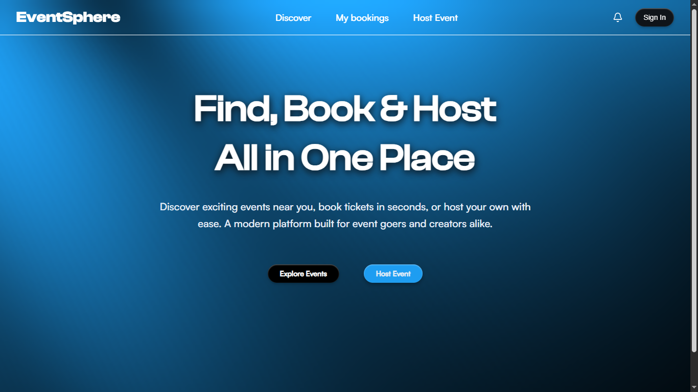

# EventSphere

A full‑stack event booking and hosting platform built as a production‑grade MERN + TypeScript project.

## Overview

EventSphere allows users to discover, book, and manage events, while verified hosts can create and manage their own events, coupons, and dashboard analytics.


## Features

### User Side

* Browse and search events (text search, filters, sorting)
* Debounced search (500ms)
* Event detail view
* Stripe payments for bookings
* Automatic ticket email
* Bookings history page
* Review booked event
* Mobile‑friendly UI

### Host System

* Host verification via $1 Stripe payment
* Host‑only protected routes
* Create, update, delete (soft delete) events
* Coupon CRUD
* Dashboard with basic analytics (total revenue, total bookings, event performance)

### Backend

* Express + TypeScript + MongoDB
* MVC architecture
* JWT auth + Google OAuth
* Stripe integration (bookings + host verification)
* Nodemailer for transactional emails
* Cloudinary for image uploads
* Aggregation pipelines for filters and analytics
* MongoDB indexes for performance

### Frontend

* React 18 + TypeScript
* React Query (data fetching, caching, dedupe)
* Zustand (UI state)
* TailwindCSS + shadcn/ui
* Responsive design
* Clean, minimal dashboard layout

## Architecture

### High‑Level Structure

* **Frontend:** SPA deployed on Vercel
* **Backend:** REST API deployed on Railway
* **Database:** MongoDB (Atlas)
* **Storage:** Cloudinary for event images
* **Payments:** Stripe Checkout
* **Email:** Nodemailer (SMTP)

### Flow Summary

#### Booking Flow

1. User selects event and initiates booking.
2. Backend creates Stripe Checkout session.
3. On success, backend records booking and triggers confirmation email.
4. User is redirected to booking confirmation page.

#### Host Verification Flow

1. User attempts to access host tools.
2. System checks host status.
3. If not verified, user completes a $1 Stripe payment.
4. Backend marks user as verified host.

#### Event Management

* Hosts can create/update events.
* Events with existing bookings cannot be hard‑deleted.
* "Deleted" events are soft‑deleted (archived) for data integrity.

## Tech Stack

### Frontend

* React 18
* TypeScript
* React Query
* Zustand
* TailwindCSS
* shadcn/ui

### Backend

* Node.js / Express
* TypeScript
* MongoDB + Mongoose
* Stripe
* Nodemailer
* Cloudinary

## Deployment

* **Frontend:** Vercel
* **Backend:** Railway
* **Database:** MongoDB Atlas
* **Image Hosting:** Cloudinary

## Key Packages

* `react-query`
* `zustand`
* `mongoose`
* `stripe`
* `nodemailer`
* `cloudinary`

## Folder Structure (Backend)

```
src/
  controllers/
  db/
  middleware/
  models/
  routes/
  types/
  utils/
  app.ts
  index.ts
```

## Folder Structure (Frontend)

```
src/
  api/
  assets/
  components/
  hooks/
  lib/
  store/
  utils/
  App.css
  App.tsx
  index.css
  main.tsx
```

## Screenshots


## Roadmap (Completed & Planned)

### Completed

* Event CRUD
* Booking system with Stripe
* Host verification
* Basic analytics
* Cloud image uploads
* User bookings page
* Mobile responsive structure

### Planned

* Calendar invite (.ics) support
* UI micro‑interactions